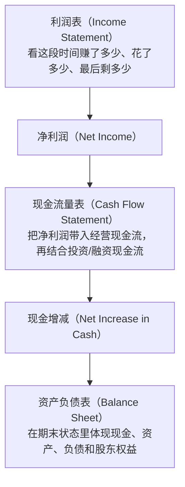
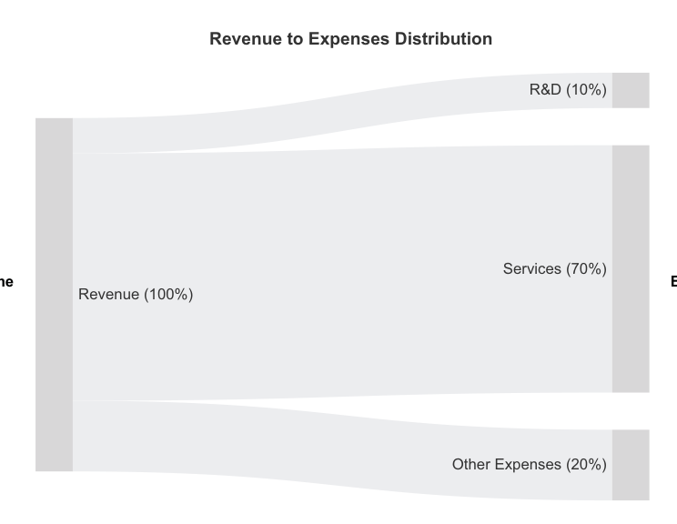

# Chapter 2 笔记: Investment essentials

## 笔记说明

- 本笔记用于承接 Chapter 2 的预习、问答和后续总结。
- 当前版本为本章整理版，已合并预习内容、问答沉淀和阶段总结，目标是把这一章的财务语言门槛降下来。
- 如果你没有会计基础，建议先读 [ACCOUNTING_PRIMER.md](/Users/gmet/Projects/learning/Investing-for-Programmers/notes/ACCOUNTING_PRIMER.md) 再进正文。

## 本章信息来源

- 直接解析 PDF：已解析原书 PDF 本体
- 章节目录提取：已提取 Chapter 2 及其小节目录
- 页码样本抽取：已抽取 PDF 第 43, 44, 45, 46, 47, 48, 60, 74, 75 页
- 回退方案：本章暂未使用回退方案

## 快速导航

1. 本章导读：这一章在讲什么、最重要的概念是什么、读完后应能回答什么
2. 学习优先级与启动：先读哪里、重点抓什么、为什么不是只看公式
3. 分节笔记：按 `2.1` 到 `2.5` 重组主体内容、图表、案例和阅读提醒
4. 按投资方向的阅读路线：基金投资者版、债券投资者版
5. 章节收束：这一章最终要留下哪些原则
6. 问答沉淀：把已经形成稳定结论的问题集中存档

## 本章导读

### 本章主要内容

这一章的任务很直接：补齐做投资研究时最基础的“财务语言”。

作者不是想把你训练成会计，而是要让你至少能读懂：

1. 公司最基本的三张表在说什么
2. 行业分类为什么会影响指标解释
3. 公司大小、财务比率、外部评级分别在帮助判断什么

如果说 Chapter 1 是在建立“资产地图”，那 Chapter 2 就是在建立“读公司和读报表的基础语法”。

### 本章结构

1. `Accounting in a nutshell`
2. `Industry classification`
3. `Capitalization`
4. `Metrics and ratios`
5. `External assessments`

### 本章最重要的概念

#### 1. 财务报表像公司的 source code

作者用一个很适合程序员的比喻：财务报表就像公司的 `source code`。刚开始看会觉得抽象，但一旦知道每个部分在干什么，就能从里面读出企业运行状态。

#### 2. 三张表是最小阅读门槛

你至少要先能区分：

- 利润表 / 损益表（income statement）：这段时间赚了多少、花了多少、最后剩多少
- 资产负债表（balance sheet）：公司现在拥有什么、欠了什么
- 现金流 / 自由现金流（cash flow / free cash flow）：公司真正产生了多少现金

#### 3. 比率不是脱离行业使用的

同样一个比率，在不同公司、不同产业、不同经济周期里，解释可能完全不同。作者在这一章会反复提醒你：指标不是独立真理，它总是依附在行业背景里。

#### 4. 财务分析不是找唯一答案，而是形成 hypothesis

你在看报表和比率时，很多时候不是得到“正确答案”，而是在形成：

- bullish hypothesis
- bearish hypothesis

也就是基于财务信息，对公司未来的可能发展提出更有依据的判断。

### 读完本章后你应该能回答的问题

1. `income statement`、`balance sheet`、`free cash flow` 分别在回答什么问题
2. 为什么不能脱离行业去硬比公司的指标
3. `P/E`、`debt-to-equity`、`liquidity`、`profitability` 这些词分别在看公司什么维度
4. 为什么“会看比率”不等于“已经会投资”
5. 外部评级和目标价为什么能参考，但不能替代自己的判断

### 关键术语预告

- 利润表 / 损益表（income statement）
- 资产负债表（balance sheet）
- 自由现金流（free cash flow, FCF）
- 运营费用 / 经营费用（OpEx, operating expenses）
- 资本开支（CapEx, capital expenditure）
- 研发（R&D, research and development）
- 机会成本（opportunity cost）
- 总拥有成本（total cost of ownership, TCO）
- 行业分类（industry classification）
- 市值 / 资本规模（capitalization）
- 比率（ratio）
- 流动性（liquidity）
- 债务（debt）
- 估值（valuation）
- 盈利能力（profitability）
- 评级（ratings）
- 目标价（target prices）

更完整的术语整理见 [GLOSSARY.md](/Users/gmet/Projects/learning/Investing-for-Programmers/notes/GLOSSARY.md) 中的 Chapter 2 部分。

### 少量关键原文

- 原文短摘录：`Think of financial statements as a company's source code.`
  - 位置：PDF 第 44 页，`2.1 Accounting in a nutshell`
  - 中文解释：作者建议程序员把财务报表理解成企业运行逻辑的“源码”
  - 我的补充理解：这是进入第二章最重要的类比，后面很多抽象概念都可以借这个比喻理解

- 原文短摘录：`investing without understanding at least the basics of accounting is like trying to create a software application with zero programming skills`
  - 位置：PDF 第 44 页，`2.1 Accounting in a nutshell`
  - 中文解释：作者在强调基础财务知识不是可选项
  - 我的补充理解：这句话直接定义了第二章的必要性

- 原文短摘录：`Still, when looking up ratios, it makes sense to look up the company's sector to add context.`
  - 位置：PDF 第 53 页，`2.2 Industry classification`
  - 中文解释：看财务比率时，先确认公司所在行业，才能给这些数字加上正确语境
  - 我的补充理解：这句话几乎就是“行业分类这一节为什么存在”的一句话答案。比率不是脱离行业独立生效的，先看 `sector`，再看 `ratio`，判断才不容易跑偏

- 原文短摘录：`Investing only in companies whose business you understand`
  - 位置：PDF 第 54 页，`2.2.2 Sectors and economic cycles`
  - 中文解释：只投资那些你真正理解其业务模式的公司
  - 我的补充理解：这句和前面的“先看行业再看比率”是连在一起的。真正理解一家公司，不只是看几个数字，而是要知道它靠什么赚钱、受什么变量影响、在经济周期里通常会怎么表现

- 原文短摘录：`companies producing goods for everyday needs are less affected by crises`
  - 位置：PDF 第 54 页，`2.2.2 Sectors and economic cycles`
  - 中文解释：生产日常必需品的公司，通常受经济危机冲击更小
  - 我的补充理解：作者不是在给“必需消费一定更好”的绝对结论，而是在教你理解行业的周期敏感性。需求越刚性，通常越抗经济下行；可推迟消费越多，通常越受危机冲击

- 原文短摘录：`The number of employees at a company can be a misleading indicator of size. A more suitable metric for investors to consider is capitalization.`
  - 位置：PDF 第 56 页，`2.3 Capitalization`
  - 中文解释：用员工人数判断公司大小很容易误导投资者，更合适的尺度是市值 / 资本规模（capitalization）
  - 我的补充理解：作者这里是在把“公司大小”的讨论，从直觉认知切换到投资语境。投资里更重要的不是公司有多少人，而是市场当前愿意给它什么估值

### 本章与程序员能力的关系

- 程序员本来就擅长从复杂结构里找关键变量，这和读报表很像
- 你可以把财务分析理解成“读系统状态”，而不是背会计定义
- 这一章会给你后面用脚本抓取数据、算比率、做筛选建立语义基础

### 建议阅读方式

这一章建议 `精读`。它是后面 Chapter 3 抓数据、Chapter 4-6 做研究和组合的语言基础。

## 学习优先级与启动

### 这一章到底哪部分最重要

如果只问“Chapter 2 的单点重点是哪一节”，我会给这个判断：

- **不是只有 `2.4` 是重点**
- **真正的核心地基是 `2.1 + 2.2 + 2.4`**

可以把它们这样分工理解：

- `2.1 Accounting in a nutshell`
  - 最基础
  - 它决定你能不能看懂三张表和后面的所有指标语言

- `2.2 Industry classification`
  - 方法重点
  - 它决定你会不会把指标放错语境

- `2.4 Metrics and ratios`
  - 工具重点
  - 它决定你会不会把财务语言转成实际判断

#### 如果一定要只选一节

- 从“后面能不能继续读下去”的角度：`2.1` 最重要
- 从“这一章里最像可直接上手的工具箱”的角度：`2.4` 最重要

#### 为什么不是只看 `2.4`

因为如果没有前面的两层地基：

- 不懂 `2.1`，你会不知道这些指标从哪里来
- 不懂 `2.2`，你会不知道这些指标该放在什么行业语境里解释
- 直接冲进 `2.4`，很容易变成“会看公式，但不会判断”

#### 当前最稳的优先级

1. `2.1`：先分清三张表
2. `2.2`：先建立“先看行业再看指标”的习惯
3. `2.4`：再学指标到底在回答什么问题
4. `2.3`、`2.5`：作为补充层

### 这一章先怎么读

- 第一段先读 PDF 第 43-48 页
- 目标不是记住所有会计术语，而是先理解“三张表各自回答什么问题”
- 这一段读完，只要能说清三个问题就够了：
  1. 作者为什么把财务报表比作公司的 `source code`
  2. 三张表各自在回答什么问题
  3. 为什么作者强调财务分析是在形成 hypothesis，而不是直接得出结论

### 第一段最该抓住的内容

- 第二章的核心不是学会计，而是获得读财务语言的最低能力
- 三张表分别对应经营结果、资源结构和现金状态
- 投资判断不是从单个数字直接得出，而是把数字放进业务和时间变化里解释

### 第一段阅读提醒

- 不要急着把所有比率背下来
- 先把三张表的角色分清
- 遇到指标时，优先问“这个指标想衡量什么”

## 分节笔记

### 2.1 Accounting in a nutshell

#### 这一节最该抓住的主线

- 第二章的核心不是学会计，而是获得读财务语言的最低能力
- 三张表分别对应经营结果、资源结构和现金状态
- 投资判断不是从单个数字直接得出，而是把数字放进业务和时间变化里解释

#### 利润表到底在补什么视角

- **利润表不仅告诉你公司赚了多少钱，也会暴露它把钱主要花在了哪里，因此能帮助你判断这家公司到底在走什么策略。**
- 换句话说，利润表不只是结果表，也是经营优先级的线索表。
- 你看费用结构，常常能读出公司是在押研发、抢市场、提效率，还是被动收缩。

#### 图 2.1 的中文流程版

你可以把图 2.1 直接理解成下面这条链：

##### 这张图最想让你看到什么

- 三张表不是彼此独立的
- 利润表先给出经营结果
- 现金流量表告诉你这些结果最后有没有变成现金
- 资产负债表展示这段过程结束后，公司站在什么状态上

##### 一句话记忆

- 利润表：这段时间经营得怎么样
- 现金流量表：钱到底怎么流动了
- 资产负债表：到最后公司还剩下什么状态

#### 图 2.2

- 原图位置：Chapter 2 `Investment essentials`
- PDF 页码：第 47 页
- 图号：Figure 2.2
- 原图文件：[ch02_figure_2_2.png](/Users/gmet/Projects/learning/Investing-for-Programmers/notes/assets/ch02_figure_2_2.png)

##### 这张图在表达什么

- 它是作者虚构出来的一个咨询公司示意图
- 重点是在展示“收入主要来自哪里、支出主要花到哪里”
- 它不是所有公司的通用模板

##### 看这张图时要抓什么

- 这家公司主要靠卖服务赚钱
- 支出的大头是提供服务的人力成本
- 还有一部分支出放在研发 / 培训 / 能力建设
- 这张图更像业务结构图，不是完整利润表截图

#### Eugene 这个例子真正想教什么

##### 1. 有价值，不等于有流动性

Eugene 手里其实不穷：

- 有古董车库存
- 有厂房和设备
- 有稀有零件
- 甚至还有客户欠款

问题在于，这些东西虽然值钱，但不能立刻变成现金去付：

- 工资
- 水电
- 修理费
- 短期贷款

所以作者是在区分两件事：

- `有资产`
- `有足够现金应付眼前付款`

这不是一回事。

##### 2. 公司可能“账面富”，但“手头紧”

这个例子不是在说 Eugene 的生意一定差。

恰恰相反，作者甚至暗示：

- 他买到了一批便宜的好车
- 未来卖出去可能有很高利润

但即便如此，他现在仍然可能出问题，因为：

- 钱都压在库存里了
- 短期付款已经到期
- 银行也不一定愿意继续借钱

这就是典型的：

- 长期可能赚钱
- 短期可能断现金

##### 3. 作者是在引出 `liquidity` 和 `insolvency`

这段的重点不是古董车，而是两个财务概念：

- 流动性（liquidity）：
  - 你有没有足够容易变现的资源去应付短期付款

- 偿付困难 / 无力清偿（insolvency）：
  - 当你无法按时支付应付账款、工资、利息或到期债务时，就会进入危险区

##### 一句话版

- Eugene 的例子在说：**公司可能很值钱，但仍然会因为现金不够而出问题。**

#### 一个很值得保留的视角差异

##### 工程视角 vs 经营视角

这段话很适合程序员特别记一下，因为它说的其实不只是企业 IT 决策，也适用于投资判断。

- 工程视角更容易关注：
  - 技术方案是否更稳
  - 长期是否更省钱
  - 是否降低持续运营成本（OpEx）
  - 是否提升掌控力和系统效率

- 经营视角更容易继续追问：
  - 前期投入的 CapEx 会不会太大
  - 这会不会压缩当前流动性
  - 这笔钱还有没有更好的用途（opportunity cost）
  - 总拥有成本（total cost of ownership, TCO）算下来是不是真的更优

##### 这一段对我们的提醒

- “长期更便宜”不自动等于“现在就该做”
- “技术上更优”不自动等于“财务上更优”
- 任何看起来合理的长期方案，都还要经过现金流、流动性和机会成本的检验

##### 一句话版

- 工程师更容易问“这方案长期是不是更有效率”
- 经营管理者更容易问“公司现在有没有余力为这份长期效率买单”

#### 遇到牛/熊假设同时成立时，实际怎么做

这是第二章里非常值得保留的阅读方法。

##### 第一步：先接受“不确定”是正常状态

很多财务信息只能支持多种解释：

- 研发费用大增，可能是未来增长前兆
- 也可能是现有业务变差，只能靠加投入硬撑

所以这时不要急着问：

- 到底哪个才是真的？

而是先问：

- 如果牛假设是真的，后面我应该看到什么？
- 如果熊假设是真的，后面我又会看到什么？

##### 第二步：把假设转成可观察信号

例如图里的例子，你可以这样拆：

- 如果是牛假设：
  - 后面收入应该增长
  - 新业务或新客户应逐步兑现
  - 现金流不应长期恶化
  - 新增债务应该带来更强经营结果

- 如果是熊假设：
  - 收入没有跟上
  - 债务继续增加
  - 现金流继续承压
  - 管理层解释越来越站不住脚

##### 第三步：继续收集证据，而不是在证据不足时强行下注

这时你可以继续看：

- 下一期财报
- 现金流变化
- 资产负债表恶化还是改善
- 管理层解释是否一致
- 同行业公司有没有类似现象

##### 第四步：在不确定时控制动作大小

如果证据还不够，最稳的做法通常不是重仓猜对，而是：

- 继续观察
- 小仓位试错
- 或者暂时不做决定

##### 一句话版

- 牛和熊假设同时存在，不代表分析没用
- 它说明你已经从“看数字”进入“解释数字”
- 真正重要的是把假设继续变成可验证、可更新的判断框架

##### 你的理解

- 待补充

### 2.2 Industry classification

#### 这一节现在真正要抓住的重点

- 同一个比率，在不同行业里含义可能完全不同
- 比较公司时，先找可比对象，比直接横着乱比更重要
- 行业和经济周期会影响你怎么解释财务数据

#### 现在不必用力过猛的部分

- 不需要背完整 GICS 层级
- 不需要记住所有 sector 和 industry 名单
- 不需要一开始就追求“看到公司就立刻准确归类到最细分行业”

#### 当前阶段最够用的目标

- 知道“行业分类存在，是为了帮助比较”
- 知道“先和同行比，再和跨行业公司比”
- 知道“行业不同，成本结构、利润率、负债结构、估值习惯都会不同”

#### Table 2.1

##### 这张表在说什么

`Table 2.1` 不是让你去背所有行业细目，而是在建立一个很重要的阅读习惯：

- 先看公司属于哪个 `sector`
- 再看这个 `sector` 主要受哪些外部因素影响

它的表头其实就 3 列：

- `Sector`
- `What it does`
- `Influenced by`

也就是说，作者想让你把“行业分类”读成一张 `业务类型 -> 关键影响因子` 的映射表。

##### 这张表最值得抓住的结论

- `Utilities` 更容易受利率、能源价格、监管和债券收益率影响
- `Consumer Staples` 更容易受通胀、原材料成本和消费者信心影响
- `Consumer Discretionary` 更容易受消费支出、失业率和可支配收入影响
- `Communication Services` 更容易受监管、竞争、技术变化和整体经济环境影响
- `Real Estate` 更容易受人口变化、利率、经济周期和住房需求影响
- `Information Technology` 更容易受创新节奏、网络安全威胁和监管变化影响
- `Energy` 更容易受油价、地缘政治和新能源趋势影响
- `Health Care` 更容易受监管、药价、人口结构和公共卫生事件影响
- `Financials` 更容易受利率、经济周期和监管变化影响
- `Industrials` 更容易受制造业景气度、贸易政策和大宗商品价格影响
- `Materials` 更容易受商品价格、供应链稳定性和环保监管影响

##### 你现在应该怎么用这张表

- 不要把它当“背诵表”
- 要把它当“解释表”

最实用的读法是：

- 看到一家公司，先问它属于什么行业
- 再问这个行业通常受什么变量影响
- 然后再看它的财务指标和股价表现是不是和这些变量能对上

##### 一句话记忆

- `Table 2.1` 想教你的不是行业名称本身，而是“公司不是在真空里经营，行业会决定你该盯哪些外部变量”。

### 2.3 Capitalization

#### 这一节最核心的一句话

- 用员工人数判断公司大小很容易误导投资者，更合适的尺度是市值 / 资本规模（capitalization）。

#### 这节在投资语境里到底在补什么

- 它是在把“公司大不大”的讨论，从直觉认知切换到投资语境。
- 投资里更重要的不是公司有多少人，而是市场当前愿意给它什么估值。
- 所以 `capitalization` 更像是投资世界里理解“公司大小”和“风格分层”的入口。

#### 当前阶段最够用的理解

- 对基金投资者：它帮助你理解大盘、中盘、小盘的区别。
- 对指数基金、风格基金和主题基金：很多产品本身就是按市值特征在分层。
- 对个股阅读：它提醒你不要把“员工多”误当成“投资意义上的大公司”。

### 2.4 Metrics and ratios

#### 2.4 一页版总览

`2.4 Metrics and ratios` 可以直接理解成“作者给你的一组基础仪表盘”。
它不是在追求某个万能指标，而是在拆不同问题分别该看什么。

| 小节 | 主要回答什么问题 | 对基金投资者的重要性 | 对债券投资者的重要性 | 当前阅读提醒 |
| --- | --- | --- | --- | --- |
| `2.4.1 Liquidity` | 公司短期会不会缺钱、能不能付眼前账单 | 中 | 很高 | 先理解“短期活不活得下去”，不要急着背公式 |
| `2.4.2 Debt` | 公司杠杆高不高、债务压力大不大 | 高 | 很高 | 债券视角尤其重要，先抓“会不会被债压垮” |
| `2.4.3 Earnings` | 公司到底赚不赚钱、赚钱能力稳不稳 | 高 | 高 | 先看盈利是否能支撑经营和债务，而不是只看增长故事 |
| `2.4.4 Valuation` | 市场现在给这个公司定价贵不贵 | 高 | 中 | 重点不是便宜贵，而是“相对什么而言贵或便宜” |
| `2.4.5 Profitability` | 公司把收入变成利润的能力强不强 | 高 | 中到高 | 记住它和行业强相关，不能乱横比 |
| `2.4.6 Dividends` | 公司分红高不高、分红是否可持续 | 中到高 | 低到中 | 如果你关心红利基金或现金流，这一节会更重要 |
| `2.4.7 Insider trading` | 公司内部人最近是买还是卖 | 低到中 | 低 | 只能当辅助信号，不能单独下结论 |
| `2.4.8 Sustainability` | 公司 ESG / 可持续性表现怎样 | 低到中 | 低到中 | 更像附加维度，不是当前入门主线 |

#### 这节最该怎么读

- 不要先背公式
- 先分清每个指标在看哪一类风险或质量
- 再去理解它更适合和谁比

#### 一句话记忆

- `2.4` 的重点不是“学会一个神奇指标”，而是“学会把公司拆成流动性、债务、盈利、估值、盈利质量和分红这些不同面向来检查”。

#### 一个很值得先记住的小链条

- `earnings`：公司总共赚了多少
- `EPS`：平均到每一股，赚了多少
- `P/E`：股价相对于每股收益，贵不贵

也就是说：

- `earnings` 是总量
- `EPS` 是每股版本
- `P/E` 是价格和每股盈利之间的关系

#### 2.4.1-2.4.8 指标整理

下面这张表不是按“公式优先”，而是按“它到底在回答什么问题”来整理；这次把中文名和常见公式也补齐了。

| 小节 | English | 中文名称 | 常见公式 / 口径 | 它主要在看什么 | 当前怎么理解最够用 |
| --- | --- | --- | --- | --- | --- |
| `2.4.1 Liquidity` | `current ratio` | 流动比率 | `current assets ÷ current liabilities` | 短期资产够不够覆盖短期负债 | 看公司短期会不会缺钱，但别跨行业乱比 |
| `2.4.1 Liquidity` | `quick ratio` | 速动比率 | `(cash + marketable securities + receivables) ÷ current liabilities` | 不靠库存，能不能马上应付短期债务 | 比 `current ratio` 更严格，更接近“今天就要付钱行不行” |
| `2.4.2 Debt` | `debt-to-equity (D/E)` | 债务股本比 / 债务权益比 | `total liabilities ÷ shareholders' equity` | 公司有多依赖债务融资 | 杠杆高不高要结合行业和融资策略一起看 |
| `2.4.2 Debt` | `interest coverage ratio` | 利息保障倍数 | `EBIT ÷ interest expense` | 赚的钱够不够付利息 | 低于 `1.0` 是硬红旗，说明利润连利息都盖不住 |
| `2.4.3 Earnings` | `earnings per share (EPS)` | 每股收益 | `(profit - preferred dividends) ÷ shares outstanding` | 平均到每一股，赚了多少 | 是 `earnings` 的每股版本，也是很多估值比率的基础 |
| `2.4.3 Earnings` | `free cash flow per share` | 每股自由现金流 | `FCF ÷ shares outstanding` | 平均到每一股，真正剩下多少自由现金 | 比单看利润更接近“每股能拿到多少真钱能力” |
| `2.4.3 Earnings` | `free cash flow (FCF)` | 自由现金流 | `operating cash flow - CapEx` | 经营拿到现金后，扣掉必要资本开支，还剩多少 | 更接近公司真正可支配的现金能力 |
| `2.4.4 Valuation` | `P/E` | 市盈率 | `share price ÷ EPS` | 为每 `1` 单位盈利付了多高价格 | 最常见估值指标，但一定要结合同行和行业中位数看 |
| `2.4.4 Valuation` | `forward P/E` | 预期市盈率 | `current share price ÷ expected future EPS` | 市场按未来预期盈利给了多高价格 | 更偏“市场对未来的定价” |
| `2.4.4 Valuation` | `trailing P/E` | 历史市盈率 | `current share price ÷ trailing EPS` | 市场按过去已实现盈利给了多高价格 | 更偏“基于已发生业绩的定价” |
| `2.4.4 Valuation` | `PEG ratio` | 市盈增长比 | `P/E ÷ EPS growth rate` | 当前估值相对于盈利增长速度贵不贵 | 用来补 `P/E` 不看增长的问题 |
| `2.4.4 Valuation` | `price-to-sales (P/S)` | 市销率 | `market cap ÷ sales` 或 `share price ÷ sales per share` | 为每 `1` 单位销售额付了多高价格 | 适合看早期或利润不稳定但收入增长快的公司 |
| `2.4.4 Valuation` | `price-to-book (P/B)` | 市净率 | `market price ÷ book value per share` | 为每 `1` 单位账面净资产付了多高价格 | 对资本密集型公司更有参考价值 |
| `2.4.4 Valuation` | `beta` | 贝塔值 | 相对市场收益波动回归得出，无单一手算公式 | 这只股票相对大盘有多波动 | 更像风险 / 波动指标，不是基本面质量指标 |
| `2.4.5 Profitability` | `return on assets (ROA)` | 资产回报率 | `net income ÷ total assets` | 公司用资产赚钱的效率 | 看“手里这些资产用得值不值” |
| `2.4.5 Profitability` | `return on equity (ROE)` | 股本回报率 / 净资产收益率 | `net income ÷ shareholders' equity` | 公司替股东资本赚钱的效率 | 看股东的钱用得好不好 |
| `2.4.5 Profitability` | `profit margin` | 利润率 | `net income ÷ revenue` | 每 `1` 单位收入最后留下多少利润 | 利润率强弱很依赖行业，不要乱横比 |
| `2.4.6 Dividends` | `dividend yield` | 股息率 | `annual dividend per share ÷ share price` | 按当前股价看，分红现金回报率是多少 | 不能脱离股价看，高股息不自动等于好投资 |
| `2.4.6 Dividends` | `payout ratio` | 派息率 / 股息支付率 | `dividends ÷ earnings` | 利润里有多少比例被拿去分红 | 看分红是不是过高、是否可能影响再投资 |
| `2.4.6 Dividends` | `dividend growth rate` | 股息增长率 | 常见口径：`(current dividend - prior dividend) ÷ prior dividend` | 分红增长得快不快、稳不稳 | 看分红是否有延续性，不只看当下股息率 |
| `2.4.7 Ownership` | `outstanding shares` | 流通在外股数 | 定义型指标，无固定比率公式 | 公司总共有多少流通在外股数 | 影响每股指标，也关系到稀释或回购 |
| `2.4.7 Ownership` | `float` | 自由流通股 / 流通盘 | 常见口径：`outstanding shares - restricted/locked shares` | 真正可供市场交易的股数有多少 | 帮助理解流动性和交易结构 |
| `2.4.7 Ownership` | `insider transactions` | 内部人交易 | 定义型指标，无固定统一公式 | 公司内部人最近在买还是卖 | 只能当辅助信号，不能单独下结论 |
| `2.4.7 Ownership` | `insider purchases / sales` | 内部人买入 / 卖出 | 统计买卖股数、次数、净买入占比等口径 | 内部人买卖数量和交易次数 | 看管理层行为变化，但要结合背景解释 |
| `2.4.8 Sustainability` | `total ESG score` | 总 ESG 评分 | 第三方评分模型，无统一公开公式 | 公司整体 ESG 表现如何 | 适合在你关心可持续性时作为附加筛选 |
| `2.4.8 Sustainability` | `environment score` | 环境评分 | 第三方评分模型 | 环境维度表现如何 | ESG 的子项之一 |
| `2.4.8 Sustainability` | `social score` | 社会评分 | 第三方评分模型 | 社会责任维度表现如何 | ESG 的子项之一 |
| `2.4.8 Sustainability` | `governance score` | 治理评分 | 第三方评分模型 | 公司治理维度表现如何 | ESG 的子项之一 |
| `2.4.8 Sustainability` | `peer ESG / peer category performance` | 同行 ESG 对比表现 | 同行分组比较口径，无统一单一公式 | 跟同行比，这家公司 ESG 表现如何 | ESG 也要看同行，不是看孤立分数 |

#### 现在最值得优先抓住的几项

如果你不想一次吃太多，先抓这 8 个最够用：

- `current ratio`
- `quick ratio`
- `debt-to-equity`
- `interest coverage ratio`
- `EPS`
- `P/E`
- `ROE`
- `dividend yield`

#### 为什么先抓这 8 个

- 它们基本覆盖了：短期偿付、债务压力、每股盈利、估值、股东回报和分红
- 后面你看基金、债券、个股时，都会频繁遇到它们
- 先把“它们在看什么问题”搞清楚，比先背公式更重要

#### 看这些公式时要注意什么

这些公式本身不难，真正容易出错的是“怎么用”。

##### 1. 不要脱离行业去硬比

- `current ratio`、`profit margin`、`P/E`、`ROE` 这类指标在不同行业里的正常区间差很多
- 先和同行比，再谈高低

##### 2. 不要只看单个指标

- 一个指标只能照到公司的一部分
- 例如 `P/E` 低，不代表一定便宜；也可能是市场在提前反映问题
- 例如 `dividend yield` 高，不代表一定好；也可能是股价已经跌了很多

##### 3. 要分清它是“过去”还是“未来”

- `trailing P/E` 看的是过去已实现盈利
- `forward P/E` 看的是未来预期盈利
- 预期数字带主观判断，不能和历史数字混着看

##### 4. 注意分母是否会让结论失真

- `EPS` 会受 `shares outstanding` 变化影响，增发和回购都会改它
- `P/E` 在盈利很低时会被放大，在亏损时甚至失去意义
- `ROE` 在股东权益很小的时候，可能会显得异常高

##### 5. 注意会计口径和一次性项目

- 盈利、利润率、`EPS` 都可能受一次性收益/损失影响
- 看到特别好看的数字，要追问：这是常态，还是一次性事件

##### 6. 注意现金和利润不是一回事

- 看 `earnings`、`EPS` 时，最好同时看 `FCF`
- 账面利润好，不等于现金真的到手

##### 7. 注意股价会反向影响一些指标

- `P/E`、`P/S`、`P/B`、`dividend yield` 都会受股价变化影响
- 指标变“更便宜”或“更高息”，不一定是基本面改善，也可能只是价格大跌

##### 8. 低或高都不自动代表好坏

- 低 `D/E` 不一定最好，可能只是公司没有效利用资本
- 高 `ROE` 不一定最好，可能是杠杆过高
- 高 `current ratio` 不一定最好，可能说明资金利用效率不高

##### 一套最够用的检查顺序

看到一个 ratio 时，先问这 5 句：

1. 它在衡量什么？
2. 这个值应该和谁比？
3. 它是历史值还是预期值？
4. 它会不会被股价、股本、一次性项目扭曲？
5. 需要哪个别的指标一起看，才不容易误判？

### 2.5 External assessments

#### 2.5 略读版

`2.5 External assessments` 讲的是：**市场上还有很多“别人已经帮你做过一层判断”的外部信息**，比如分析师评级和目标价，但它们只能当参考，不能替代你自己的判断。

#### 这一节主要在讲什么

- `ratings`
  - 分析师会给公司打 `buy / hold / sell` 这类评级
  - 书里还提到两类来源：
    - 专业机构分析师
    - 平台上的 crowdsourced analysis（众包分析）

- `target prices`
  - 分析师会给出未来 `12` 个月的目标价区间
  - 这些目标价通常基于基本面分析、统计分析或机器学习

- `upgrades / downgrades`
  - 比起“当前给了什么评级”，评级是上调还是下调，有时更值得关注

#### 这一节真正想提醒你什么

- 外部评级有参考价值，但不是答案
- 目标价看起来精确，其实误差可能很大
- 就算是知名机构，也会判断错
- 与其盲信“专家怎么说”，不如把这些外部判断当成额外信号源

#### 为什么这一节适合略读

- 它是补充层，不是 Chapter 2 的主地基
- 你现在更重要的是先会读三张表、行业语境和核心比率
- 外部评级和目标价，后面做数据抓取或做研究系统时还会再遇到

#### 略读后最够用的结论

- `ratings`：可以看，但不能替你做决定
- `target prices`：可以参考市场预期，但别把它当未来真值
- `rating changes`：比静态评级更值得关注
- 这一节的价值主要是告诉你：**外部观点可以纳入研究，但绝不能外包判断**

## 按投资方向的阅读路线

### 如果你主要买基金

这时 Chapter 2 的目标，不是把你训练成能逐只深度分析个股，而是让你看懂基金底层到底装了什么、为什么会表现成现在这样。

#### 基金投资者最该重点读什么

1. `2.1 Accounting in a nutshell`
   - 目的：先建立三张表的最小理解
   - 为什么重要：基金的底层仍然是公司、债券或其他资产，不懂这些基础词，后面很难看明白基金风格

2. `2.2 Industry classification`
   - 目的：理解基金为什么会偏向某些行业
   - 为什么重要：很多基金的表现，本质上是行业配置的结果，不只是“基金经理好不好”

3. `2.3 Capitalization`
   - 目的：理解大盘、中盘、小盘的区别
   - 为什么重要：很多指数基金、风格基金和主题基金，本身就是按市值特征在分层

4. `2.4 Metrics and ratios`
   - 目的：理解基金底层资产大致贵不贵、稳不稳、赚不赚钱
   - 基金投资者优先看：
     - `2.4.2 Debt`
     - `2.4.3 Earnings`
     - `2.4.4 Valuation`
     - `2.4.5 Profitability`
     - `2.4.6 Dividends`

5. `2.5 External assessments`
   - 目的：知道外部评价能提供什么参考
   - 阅读建议：速览即可，不要把评级和目标价当成结论

#### 如果你主要买宽基 ETF

- 重点看：
  - `Industry classification`
  - `Capitalization`
  - `Valuation`
  - `Profitability`
- 核心问题：
  - 这个指数主要装了哪些行业
  - 它偏大盘还是小盘
  - 底层公司整体估值高不高
  - 底层公司整体赚钱能力怎么样

#### 如果你主要买红利基金

- 重点看：
  - `Earnings`
  - `Profitability`
  - `Dividends`
  - `Debt`
- 核心问题：
  - 这些分红是不是可持续
  - 公司是不是靠举债维持分红
  - 盈利质量够不够支撑现金分配

#### 如果你主要买债券基金

- 虽然形式上是基金，但阅读重点更接近“债券投资者版”
- 应优先看：
  - `Liquidity`
  - `Debt`
  - `External assessments`

### 如果你主要买债券

这时 Chapter 2 的任务，不是判断“这家公司未来能涨多高”，而是判断“它有没有能力按时付息还本”。

#### 债券投资者最该重点读什么

1. `2.1 Accounting in a nutshell`
   - 目的：先知道三张表分别从哪里看偿付能力
   - 为什么重要：债券最怕的不是涨得慢，而是现金流断裂和违约

2. `2.4.1 Liquidity`
   - 目的：看公司短期是否有能力支付账单和利息
   - 为什么重要：短期流动性差的公司，债券风险往往会迅速放大

3. `2.4.2 Debt`
   - 目的：看公司杠杆高不高、债务结构危险不危险
   - 为什么重要：这是债券投资最核心的章节之一

4. `2.4.3 Earnings`
   - 目的：看公司赚钱能力是否足以支撑利息支出和债务负担
   - 为什么重要：没有盈利能力，债务长期很难健康滚动

5. `2.5 External assessments`
   - 目的：理解评级和外部判断如何帮助识别信用风险
   - 为什么重要：债券世界里，评级参考价值通常高于股票世界，但仍然不能盲信

#### 债券投资者可以相对后放的内容

- `2.4.4 Valuation`
  - 股票投资里更核心，债券里不是第一优先级
- `2.4.6 Dividends`
  - 对债券判断不是核心问题
- `2.4.8 Sustainability`
  - 可以了解，但在入门阶段不必优先

#### 债券投资者最该反复问自己的问题

- 这家公司是不是有钱按时付息
- 这家公司是不是有能力到期还本
- 当前收益率，值不值得承担这份信用风险
- 如果经济转差，这家公司会不会先出问题

### 一页版结论

#### 基金投资者版

- 核心目标：看懂基金底层装了什么
- 优先读：
  - `Accounting in a nutshell`
  - `Industry classification`
  - `Capitalization`
  - `Valuation / Profitability / Debt / Dividends`
- 阅读重点：
  - 行业暴露
  - 市值风格
  - 底层资产质量

#### 债券投资者版

- 核心目标：看懂发行人能不能活着把钱还你
- 优先读：
  - `Accounting in a nutshell`
  - `Liquidity`
  - `Debt`
  - `Earnings`
  - `External assessments`
- 阅读重点：
  - 现金流
  - 偿债能力
  - 信用风险

## 章节收束

### Chapter 2 收束

这一章真正完成的，不是把一堆公式背下来，而是把“读公司”这件事拆成了几层可操作的能力：

1. 看懂三张表分别在说什么  
   利润表看经营结果，现金流量表看真钱怎么流，资产负债表看期末状态。

2. 知道指标不能脱离行业语境  
   先看 `sector`，再看 `ratio`，不再把数字当成脱离背景的结论机器。

3. 知道常见指标各自在回答什么问题  
   `liquidity` 看短期偿付，`debt` 看杠杆压力，`earnings / EPS` 看盈利，`valuation` 看定价，`profitability` 看效率，`dividends` 看现金回报。

4. 知道外部观点可以参考，但不能外包判断  
   分析师评级、目标价、升级降级都能看，但都只是补充信号。

### 如果用一句话概括 Chapter 2

- Chapter 2 不是在教你背会计和公式，而是在教你获得“读公司、读报表、读指标”的最低可用能力。

### 这一章最值得留下的 5 个原则

- 三张表要一起看，不要只盯利润表
- 先看行业，再看比率
- 指标是工具，不是结论
- 利润要和现金一起看
- 外部评级可以参考，但不能替你做决定

### 对我们当前学习路线的意义

- 这一章补的是“财务与数据阅读能力”这块地基
- 没有这层地基，后面 Chapter 3 抓数据就容易变成“抓得到，但读不懂”
- 也正因为这一章已经收束，下一章就可以更自然地转向：数据从哪里来、怎么抓、怎么组织

## 问答沉淀

### QA

1. Q：如果我要买的是基金，为什么还要读公司的财务，是不是就可以不用读第二章了？  
   A：不能直接跳过。基金只是把“挑底层资产”的工作部分外包了，但你仍然需要知道基金装了什么、为什么会涨跌、风险从哪里来。对基金投资者来说，Chapter 2 可以调整为更聚焦的路线，但不建议完全跳过。

2. Q：那如果我主要买的是债券，Chapter 2 应该重点看什么？  
   A：如果主要买债券，Chapter 2 的重点应转向偿付能力，而不是成长想象力。优先看三张表、流动性、债务、盈利和外部评级，核心问题是发行人有没有能力按时付息还本。

3. Q：为什么现金流量表常常比利润更能暴露公司有没有真实造血能力？  
   A：因为利润是按会计规则确认出来的结果，而现金流更接近“钱有没有真的到手”。一家公司可能账面盈利不错，但如果钱收不回来、经营持续烧现金、还要靠借新债撑住，那它的真实造血能力就并不好。对基金底层质量和债券偿付能力判断来说，这一点都很关键。

4. Q：利润还可以，但现金紧张，是不是也不一定说明公司不行？  
   A：对，不一定。现金紧张有时只是回款周期、扩张投入、季节性波动或短期资金安排造成的。真正需要判断的是：这种紧张是暂时的，还是结构性的；未来会改善，还是会继续恶化。

5. Q：如果这些财务数据是造假的怎么办？  
   A：这是投资里必须保留的基本怀疑。财报不是“真相本身”，而是管理层对经营现实的标准化呈现，即使有审计也不等于绝对不会出错或造假。投资者能做的不是追求绝对确定，而是做交叉验证：看利润、现金流、资产负债表能不能互相对上；看趋势是否长期协调；看同行、行业和公司叙事是否一致；并警惕应收账款异常、库存异常、频繁调整口径、换审计机构、财报重述等危险信号。

6. Q：图 2.1 是在说什么？  
   A：图 2.1 不是在教你复杂会计细节，而是在告诉你三张表是连在一起的。利润表先给出一段时间的经营结果，尤其是 `net income`；现金流量表把 `net income` 带进经营现金流，再和投资、融资现金流合起来，得到现金增减；资产负债表则展示某个时点的资源状态，包括资产、负债和股东权益。也就是说，这三张表不是三个孤立文件，而是“经营结果 -> 现金变化 -> 期末状态”的同一套系统的不同视角。

7. Q：图 2.2 是在说什么？是不是所有公司都是这样的分布？  
   A：图 2.2 是作者虚构出来的一个“咨询公司收入和支出分布”的简化模型，用来演示怎样从利润结构读出业务特征。它表达的是：这家公司主要靠卖服务赚钱，支出里大头是提供服务的人力成本，另外还有一部分研发和其他费用。它不是所有公司的通用模板，不同行业的分布会很不一样。比如零售公司会更看重库存和商品成本，制造业会有更多原材料和设备折旧，软件公司可能毛利更高但研发占比更重。所以图 2.2 重点不是记比例，而是学会问：这家公司到底靠什么赚钱、主要把钱花在哪、这个结构像不像一个健康的业务模型。

8. Q：作者针对同一个例子给出牛和熊两种假设，但结论完全相反，实际该怎么办？  
   A：实际做法不是在牛、熊两种说法里“选一个相信”，而是把它们当作两个待验证的 hypothesis。财务分析很多时候只能先缩小范围，不能一步给出确定答案。更稳的做法是：先写清楚牛假设成立需要看到什么信号、熊假设成立又会出现什么信号；然后继续看下一期财报、现金流、债务变化、管理层说明、行业环境和股价反应，逐步更新判断。如果证据还不够，就宁可保持观察、降低仓位，或者暂时不下结论。作者这里真正想教的不是“立即判断对错”，而是“在不确定中建立可更新的判断框架”。

9. Q：`The income statement reveals how much a company earns and how it allocates its expenses, which helps us evaluate a company's strategy.` 这句怎么总结？  
   A：这句话可以总结成：**利润表不仅告诉你公司赚了多少钱，也会暴露它把钱主要花在了哪里，因此能帮助你判断这家公司到底在走什么策略。** 换句话说，利润表不只是结果表，也是经营优先级的线索表。你看费用结构，常常能读出公司是在押研发、抢市场、提效率，还是被动收缩。

10. Q：`Engineers sometimes perceive economic soundness differently than business administrators...` 这段怎么总结？  
    A：这段可以总结成：**工程上看起来划算，不等于财务上就一定容易接受。** 工程师更容易从长期效率、低 OpEx、技术可控性来判断方案合理；而经营管理者会进一步追问更完整的财务问题，例如前期 CapEx 会不会压低流动性、机会成本值不值、总拥有成本（TCO）是否真的更优。作者想提醒你：投资和经营判断不能只看“长期省钱”，还要看短期资金压力和资源配置代价。

11. Q：Eugene 的古董车例子到底在讲什么？  
    A：Eugene 的例子在讲：**资产很多，不等于手上有现金；看起来值钱，不等于短期能拿来付账。** Eugene 的车、厂房、设备和客户欠款都可能很值钱，但它们不能马上拿来支付工资、水电、维修和短期债务，所以这些东西的流动性不够。作者想借这个例子说明：公司可能“有资产但没现金”，于是面临短期偿付压力；这就是为什么投资者要关心 `liquidity`，以及为什么 `insolvency`（无力清偿）风险值得用数据和算法持续监控。

12. Q：这一章节的行业分类细节是重点吗？  
    A：不是当前阶段的细节重点，但它是方法重点。你现在不需要背完整行业分类体系，也不需要记每个板块的全部子行业；真正要抓住的是：很多比率不能跨行业硬比，比较公司时要先找对可比对象。行业分类的细分类目可以速览，但“为什么要先分行业再比较”这个原则是重点。

13. Q：`Table 2.1` 说了什么？  
    A：`Table 2.1` 在做一张“行业 -> 主要业务 -> 关键影响因子”的对照表。它不是让你死记 GICS 行业名称，而是提醒你：不同 `sector` 受不同外部变量驱动。比如 `Utilities` 更受利率和监管影响，`Consumer Discretionary` 更受消费支出和失业率影响，`Information Technology` 更受创新节奏和监管变化影响，`Energy` 更受油价和地缘政治影响。核心收获是：看公司和看指标前，先把行业背景放进来。

14. Q：这一章的重点是看这些公式吗？  
    A：不是。这一章的重点不是背公式，而是知道这些公式和指标各自在回答什么问题。你现在最该抓的是：这个指标在看什么维度、适合和谁比、什么时候会误导你、对基金和债券分别有什么用。Chapter 2 更像是在建立“财务仪表盘意识”，不是会计公式默写考试。

15. Q：`FCF` 是什么？  
    A：`FCF` 是自由现金流（`free cash flow`）。最简理解是：公司靠经营拿到真钱之后，扣掉维持和扩张业务必须花的钱，最后还真正剩下多少现金。常见直觉公式是 `FCF = 经营现金流 - 资本开支（CapEx）`。它比利润更接近公司真正可支配的现金能力，也更贴近“还能拿多少钱去还债、分红、回购或再投资”。

16. Q：`2.5 External assessments` 这一节说了什么？  
    A：这一节讲的是外部判断信息，比如分析师评级（`buy / hold / sell`）、目标价（`target prices`）以及评级上调/下调（`upgrades / downgrades`）。作者想提醒你：这些信息有参考价值，但不能替代你自己的判断。对当前阶段来说，这一节更适合略读，因为它是补充层，不是 Chapter 2 的主地基；最够用的结论是“可以看外部观点，但不要把判断外包给外部观点”。
