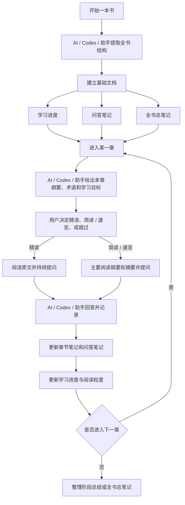

# 共学流程

## 这份文档的作用

- 这是一份给用户回看的长期共学流程说明。
- `AGENTS.md` 负责约束 AI / Codex / 助手的行为。
- 本文档负责让学习流程本身可见、可复用、可回顾。

## 这本书适合怎么学

这本书不是纯理论书，也不是纯实操手册，更适合采用：

1. 先建立框架
2. 再进入章节
3. 边学边问
4. 持续沉淀
5. 最后形成自己的研究系统

## 通用流程图

## 单章开始前，AI / Codex / 助手先给什么

每进入一章，默认先给：

1. 本章主要内容
2. 本章最重要的概念
3. 本章读完后应能回答的问题
4. 重要术语与简要解释
5. 少量值得注意的原文摘录
6. 这一章和程序员能力的关系

## 精读和速览的区别

### 精读

- 用户会直接阅读原文
- 会提出更多细节问题
- AI / Codex / 助手需要持续完善章节笔记和问答笔记

### 简读 / 速览

- 用户可能不完整通读原文
- 主要依赖纲要、摘要和少量问答完成理解
- AI / Codex / 助手不把这一章补成与精读同等密度

### 跳过

- 只记录该章被跳过
- 后续总复盘时需要明确这一点

## 值得保留的内容如何记录

如果某个概念、定义或原文很值得保留，优先按下面格式记录：

1. 原文短摘录
2. 原文位置
3. 中文解释
4. AI / Codex / 助手的扩展说明
5. 用户自己的理解、赞同或保留意见

## PDF 标注规则

本项目默认采用：`轻标注 + 外部笔记`，并且在进入新章节前，优先由 AI / Codex / 助手先生成预标注内容作为阅读提示。
如果当前主读文件是 PDF，则默认直接把预标注覆盖回主读 PDF。覆盖完成后，默认只保留这一份主读 PDF，不额外保留预标注副本，除非用户明确要求。

### 轻标注什么

- 本章主结论或关键判断
- 关键术语第一次出现的位置
- 作者对风险、限制或误用边界的提醒
- 读者明确觉得难懂、想回头追问的句子

### 不建议重标注什么

- 已经完全理解的常识句
- 纯举例但后续复用价值不高的段落
- 连续大段高亮

### 标注和外部笔记如何分工

- PDF 标注：保留“值得回看”的作者原话和位置
- 外部笔记：记录结构化总结、术语解释、问题、回答、个人理解

### 默认记录格式

优先采用：

- 原文短摘录
- 位置
- 中文解释
- 我的补充理解

### 默认执行顺序

1. AI / Codex / 助手先预读章节
2. AI / Codex / 助手先做轻标注，提示本章主结论、风险提醒、关键术语和容易疑惑的位置
3. 默认把预标注写回主读 PDF
4. 用户再阅读预标注内容
5. 问题、理解和结构化结论沉淀到外部笔记

## 学完后的收尾

一本书学到后期，重点不再是补更多零散知识点，而是：

1. 汇总哪些章节精读、哪些速览、哪些跳过
2. 整理全书总笔记
3. 整理自己的投资研究方法论
4. 明确哪些内容值得实践，哪些内容只适合理解
